<div align="center">
  
</div>

**Fully Managed OpenClaw Framework for AI Financial Governance.**
The AI CFO for the agentic economy.

VyapaarClaw is an [OpenClaw](https://openclaw.ai) framework that transforms AI agents into financially governed entities. It provides a complete governance layer — budget enforcement, vendor verification, risk scoring, compliance reporting, and human-in-the-loop approvals — so AI agents can handle real money without uncontrolled spending.

```
npx vyapaarclaw bootstrap   # Set up credentials & OpenClaw profile
npx vyapaarclaw start        # Launch MCP server + Web UI + OpenClaw gateway
```

---

## Architecture

Three-layer AI CFO architecture: **KNOW** (intelligence) → **GUARD** (governance) → **ACT** (execution):

```mermaid
graph TB
    %% Professional C4 Architecture Styling
    classDef default fill:#FFFFFF,stroke:#333333,stroke-width:2px,color:#333333,font-family:sans-serif;
    classDef interface fill:#E0E7FF,stroke:#3B82F6,color:#1E40AF,rx:8,ry:8,stroke-width:2px;
    classDef engine fill:#1E40AF,stroke:#1E3A8A,color:#FFFFFF,rx:8,ry:8,stroke-width:2px;
    classDef layer fill:#F9FAFB,stroke:#9CA3AF,color:#1F2937,rx:8,ry:8,stroke-width:2px;
    classDef intelligence fill:#EFF6FF,stroke:#3B82F6,color:#1E40AF,rx:8,ry:8,stroke-width:2px;
    classDef governance fill:#FEF3C7,stroke:#F59E0B,color:#92400E,rx:8,ry:8,stroke-width:2px;
    classDef execution fill:#DCFCE7,stroke:#10B981,color:#065F46,rx:8,ry:8,stroke-width:2px;
    classDef boundary fill:none,stroke:#6B7280,stroke-width:2px,stroke-dasharray: 4 4;

    subgraph SystemBoundary[VyapaarClaw Extended System Architecture]
        direction TB

        MCP["Core MCP Server<br/>[FastAPI / 37 Tools]"]:::engine

        subgraph LayersBoundary[Functional Tiers]
            direction TB
            subgraph KNOW[Cognitive & Intelligence Tier]
                direction LR
                FC["Cash Flow Forecaster<br/>[Darts/EWMA]"]:::intelligence
                TC["Transaction Categorizer<br/>[FinBERT]"]:::intelligence
                CA["Contract Analysis<br/>[spaCy/Regex]"]:::intelligence
                FX["Currency Conversion<br/>[Frankfurter]"]:::intelligence
                CAL["Financial Calendar<br/>[Holidays]"]:::intelligence
            end

            subgraph GUARD[Risk & Governance Tier]
                direction LR
                GOV["6-Layer Governance<br/>[Pipeline]"]:::governance
                GFD["Graph Fraud Detection<br/>[NetworkX]"]:::governance
                KYB["Vendor KYB Engine<br/>[OpenSanctions/GLEIF]"]:::governance
                BV["Bank Validation<br/>[RBI/IFSC]"]:::governance
                GST["Compliance Engine<br/>[GST/TDS]"]:::governance
                WF["Approval Workflows<br/>[State Machine]"]:::governance
            end

            subgraph ACT[Execution & Operations Tier]
                direction LR
                PAY["Payment Gateway Integration<br/>[Razorpay]"]:::execution
                LED["Double-Entry Ledger<br/>[python-acct]"]:::execution
                RPT["Document Generation<br/>[FPDF2]"]:::execution
                NTF["Notification Broker<br/>[Slack/TG/ntfy]"]:::execution
            end
        end
    end

    %% Interactions
    AGENT["AI Client Agent"]:::interface <-->|Tool Execution| MCP
    DASH["Admin Dashboard<br/>[Next.js]"]:::interface <-->|REST/GraphQL| MCP
    CLAW["OpenClaw Framework"]:::interface <-->|Integration| MCP

    MCP -->|Delegates to| KNOW
    KNOW -->|Validates via| GUARD
    GUARD -->|Triggers| ACT

    class SystemBoundary,LayersBoundary boundary
```



## Features

### 37 MCP Tools (25 Governance + 12 CFO Intelligence)

| Category | Tools |
|----------|-------|
| **Budget Control** | `get_agent_budget`, `set_agent_policy`, `get_daily_spend`, `reallocate_budget` |
| **Vendor Verification** | `check_vendor_reputation`, `verify_vendor_entity`, `get_vendor_trust_score` |
| **Risk & Scoring** | `get_risk_score`, `evaluate_payout`, `detect_anomaly` |
| **Compliance** | `generate_compliance_report`, `get_spending_trends`, `get_financial_calendar` |
| **Monitoring** | `list_agents`, `forecast_cash_flow`, `get_audit_log` |
| **Payments** | `create_payout`, `get_payout_status`, `process_webhook` |
| **Notifications** | `send_slack_approval`, `send_telegram_alert` |
| **🆕 India Tax** | `validate_gstin`, `calculate_gst`, `check_tds` |
| **🆕 Banking** | `validate_bank_account` (IFSC/account validation) |
| **🆕 Multi-Currency** | `convert_currency` (Frankfurter FX, ECB data) |
| **🆕 Calendar** | `get_indian_financial_calendar` (holidays, deadlines, T+N settlement) |
| **🆕 Categorization** | `categorize_transaction` (auto-tagging spending categories) |
| **🆕 Forecasting** | `forecast_budget_runway` (EWMA trend, runway days, severity) |
| **🆕 Accounting** | `track_payout_in_ledger`, `get_trial_balance`, `get_income_statement` |
| **🆕 Reports** | `generate_compliance_report` (PDF with charts) |
| **🆕 Fraud** | `detect_fraud_network` (graph-based: shared PAN, circular payments) |
| **🆕 Contracts** | `analyze_contract` (payment terms, penalty clauses, SLA) |
| **🆕 Sanctions** | `screen_vendor_sanctions` (OpenSanctions watchlists) |
| **🆕 Workflow** | `manage_payout_workflow` (formal state machine approvals) |

### Web Dashboard

A Next.js application providing:

- **Dashboard** — Budget utilisation bars, decision stats, risk heatmap
- **Chat** — Conversational interface to the AI CFO
- **Agents** — Agent policies, trust tiers, budget health
- **Audit Log** — Searchable governance decision history *(Driven by robust CRM Data Tables integrated directly from DenchClaw)*
- **Cron Jobs** — Scheduled autonomous operations

### OpenClaw Integration

- **Cron Jobs** — Morning financial brief, budget alarms, weekly compliance reports
- **Webhooks** — Razorpay payment event processing
- **Multi-Agent Delegation** — Spawn sub-agents for vendor due diligence
- **Canvas Dashboard** — Real-time financial visualisations
- **Skills** — CFO, delegation, and canvas skills for OpenClaw agents

### Governance Pipeline

Every transaction passes through a 6-layer verification:

1. **Webhook Signature Verification** — Razorpay HMAC validation
2. **Agent Policy Enforcement** — Daily limits, per-txn limits, domain restrictions
3. **Vendor Reputation Check** — Google Safe Browsing threat analysis
4. **Entity Verification** — GLEIF legal entity lookup
5. **ML Anomaly Detection** — Isolation Forest on transaction patterns
6. **Risk Scoring** — Composite score with automatic decision routing

---

## Quick Start

### Prerequisites

- **Python 3.12+** and [uv](https://docs.astral.sh/uv/)
- **Node.js 22+** and pnpm
- **Redis** — Budget tracking and caching
- **PostgreSQL** — Audit logs and policies
- **OpenClaw** — Required core framework for the AI agents, gateway, Slack integration, and autonomous cron features

### Installation

```bash
# Clone and install
git clone https://github.com/guglxni/VyapaarClaw.git
cd VyapaarClaw

# Install Python dependencies
uv sync --dev

# Install Node.js dependencies
pnpm install --no-frozen-lockfile

# Build the CLI and web UI
pnpm build
pnpm web:build

# Run the bootstrap wizard
node vyapaarclaw.mjs bootstrap
```

### Running

```bash
# Start everything (MCP server + Web UI + OpenClaw gateway)
node vyapaarclaw.mjs start

# Start MCP server only
node vyapaarclaw.mjs start --mcp-only

# Start without web UI
node vyapaarclaw.mjs start --no-web

# Check status
node vyapaarclaw.mjs status

# Stop all services
node vyapaarclaw.mjs stop
```

### Development

```bash
# Run MCP server in dev mode
VYAPAAR_TRANSPORT=sse uv run vyapaarclaw

# Run web UI in dev mode
pnpm web:dev

# Run Python tests
uv run pytest tests/ --ignore=tests/test_razorpay_bridge.py

# Run linter
uv run ruff check src/vyapaar_mcp/
```

---

## Project Structure

```
vyapaarclaw/
├── apps/web/              # Next.js web dashboard
│   ├── app/
│   │   ├── components/    # Dashboard, shell, charts
│   │   ├── agents/        # Agent policies page
│   │   ├── audit/         # Audit log page
│   │   ├── chat/          # CFO chat interface
│   │   └── cron/          # Scheduled jobs page
│   └── package.json
├── src/
│   ├── cli/               # Node.js CLI (bootstrap, program, web-runtime)
│   ├── vyapaar_mcp/       # Python MCP server
│   │   ├── audit/         # Decision logging
│   │   ├── db/            # Redis + PostgreSQL clients
│   │   ├── egress/        # Notifications (Slack, Telegram, ntfy)
│   │   ├── governance/    # Policy engine
│   │   ├── ingress/       # Webhooks + polling
│   │   ├── llm/           # Azure OpenAI integration
│   │   ├── observability/ # Metrics + monitoring
│   │   ├── reputation/    # Safe Browsing, GLEIF, anomaly detection
│   │   ├── resilience/    # Circuit breakers
│   │   └── server.py      # FastMCP server (25 tools)
│   └── entry.ts           # CLI entry point
├── skills/                # OpenClaw skills
│   ├── cfo/               # Core AI CFO skill
│   ├── cfo-delegation/    # Multi-agent delegation patterns
│   └── cfo-canvas/        # Canvas dashboard templates
├── templates/             # OpenClaw profile templates
├── tests/                 # Python test suite (214 tests)
└── vyapaarclaw.mjs        # CLI binary
```

---

## Configuration

### Environment Variables

| Variable | Description |
|----------|-------------|
| `VYAPAAR_RAZORPAY_KEY_ID` | Razorpay API key |
| `VYAPAAR_RAZORPAY_KEY_SECRET` | Razorpay API secret |
| `VYAPAAR_RAZORPAY_WEBHOOK_SECRET` | Razorpay webhook HMAC secret |
| `VYAPAAR_REDIS_URL` | Redis connection URL |
| `VYAPAAR_PG_DSN` | PostgreSQL connection string |
| `VYAPAAR_SAFE_BROWSING_KEY` | Google Safe Browsing API key |
| `VYAPAAR_SLACK_BOT_TOKEN` | Slack bot token for Human-in-the-Loop |
| `VYAPAAR_SLACK_CHANNEL_ID` | Slack channel ID for alerting |
| `VYAPAAR_AZURE_OPENAI_ENDPOINT` | AI endpoint (Azure / Local MLX) |
| `VYAPAAR_AZURE_OPENAI_API_KEY` | AI authentication key |

### OpenClaw Profile

The `templates/openclaw.json` configures:

- **Channels** — Telegram integration for approvals and alerts
- **Cron** — Morning brief (daily), budget alarm (30 min), weekly compliance
- **Webhooks** — Razorpay payment event processing
- **Skills** — CFO, delegation, and canvas skills
- **MCP Server** — Connection to VyapaarClaw at `localhost:8000/sse`

---

## Inspired By

- [DenchClaw](https://github.com/DenchHQ/DenchClaw) — Fully Managed OpenClaw Framework for CRM & Sales
- [OpenClaw](https://openclaw.ai) — The personal AI assistant framework

## License

[AGPL-3.0](LICENSE)
