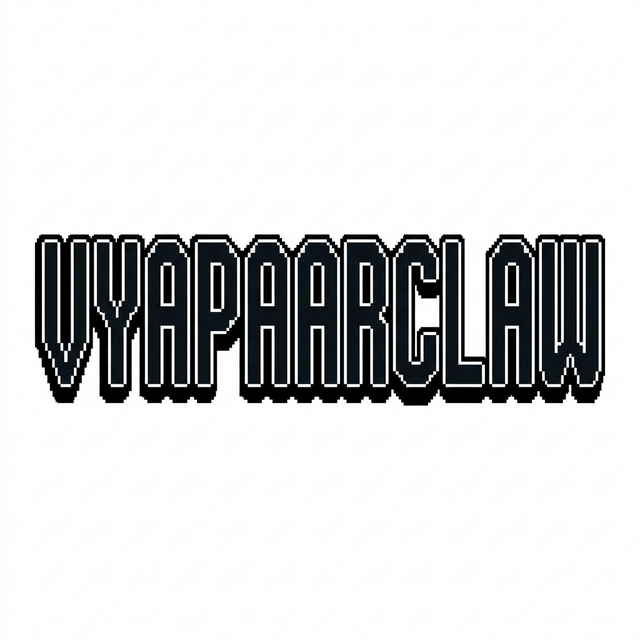
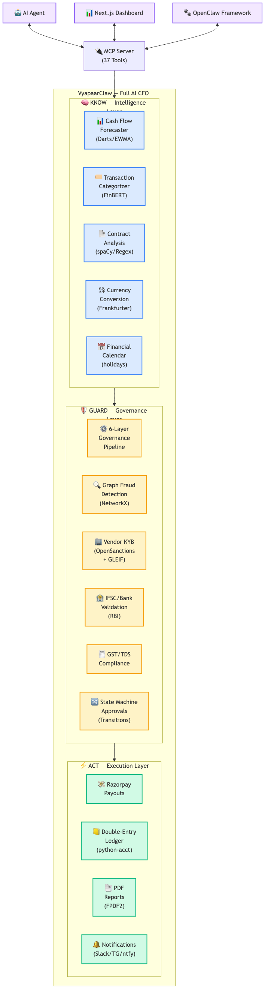

<div align="center">
  
</div>

**Fully Managed OpenClaw Framework for AI Financial Governance.**
The AI CFO for the agentic economy.

VyapaarClaw is an [OpenClaw](https://openclaw.ai) framework that transforms AI agents into financially governed entities. It provides a complete governance layer — budget enforcement, vendor verification, risk scoring, compliance reporting, and human-in-the-loop approvals — so AI agents can handle real money without uncontrolled spending.

```
npx vyapaarclaw bootstrap   # Set up credentials & OpenClaw profile
npx vyapaarclaw start        # Launch MCP server + OpenClaw gateway
```

> **Security:** Never commit `.env`. Copy from `.env.example` and keep secrets local only (OWASP secrets management).

---

## Architecture

Three-layer AI CFO architecture: **KNOW** (intelligence) → **GUARD** (governance) → **ACT** (execution):



## Features

### MCP Tools (Governance + CFO Intelligence)

| Category | Tools |
|----------|-------|
| **Budget Control** | `get_agent_budget`, `set_agent_policy`, `get_daily_spend`, `reallocate_budget` |
| **Vendor Verification** | `check_vendor_reputation`, `verify_vendor_entity`, `get_vendor_trust_score`, `screen_vendor_sanctions` |
| **Risk & Scoring** | `get_risk_score`, `evaluate_payout`, `detect_anomaly`, `score_transaction_risk` |
| **Compliance** | `generate_compliance_report`, `get_spending_trends`, `get_financial_calendar` |
| **Monitoring** | `list_agents`, `forecast_cash_flow`, `get_audit_log` |
| **Payments** | `create_payout`, `get_payout_status`, `process_webhook` |
| **Notifications** | `send_slack_approval`, `send_telegram_alert` |
| **India Tax** | `validate_gstin`, `verify_gstin_live`, `calculate_gst`, `check_tds` |
| **Banking** | `validate_bank_account` (IFSC/account validation) |
| **Research** | `research_vendor`, `screen_adverse_media` (Exa) |
| **Forecasting** | `forecast_budget_runway`, `forecast_cash_flow` |
| **Accounting** | `track_payout_in_ledger`, `get_trial_balance`, `get_income_statement` |
| **Fraud** | `detect_fraud_network`, `detect_fraud_network_ml` |
| **Workflow** | `manage_payout_workflow` |
| **CRM** | `get_denchclaw_status`, `sync_audit_to_denchclaw` |

### Web Dashboard

Static control UI served via OpenClaw gateway (`vyapaar-ui/`):

- **Dashboard** — Budget utilisation, decision stats, agent health (live MCP `/api/v1/dashboard`)
- **Audit Log** — Governance decisions synced to [DenchClaw](https://github.com/DenchHQ/DenchClaw) CRM
- **Agents / Chat / Cron** — OpenClaw-native surfaces

### OpenClaw Integration

- **Cron Jobs** — Morning financial brief, budget alarms, weekly compliance reports
- **Webhooks** — Razorpay payment event processing
- **Multi-Agent Delegation** — Spawn sub-agents for vendor due diligence
- **Skills** — CFO, delegation, and canvas skills for OpenClaw agents

### Governance Pipeline

Every transaction passes through layered verification:

1. **Webhook Signature Verification** — Razorpay HMAC validation
2. **Agent Policy Enforcement** — Daily limits, per-txn limits, domain restrictions
3. **GSTIN / IFSC Format Checks** — Indian compliance validation
4. **Vendor Reputation** — Google Safe Browsing + GLEIF + sanctions screening
5. **ML Anomaly Detection** — Isolation Forest on transaction patterns
6. **Risk Scoring** — Composite trust score with automatic decision routing

---

## Quick Start

### Prerequisites

- **Python 3.12+** and [uv](https://docs.astral.sh/uv/)
- **Node.js 22+**
- **Redis** — Budget tracking and caching
- **PostgreSQL** — Audit logs and policies
- **OpenClaw** — Agent gateway, cron, and skills

### Installation

```bash
git clone https://github.com/guglxni/VyapaarClaw.git
cd VyapaarClaw

# Install Python dependencies
uv sync --dev

# Install Node.js dependencies
pnpm install --no-frozen-lockfile

# Build the CLI
pnpm build

# Configure environment (never commit .env)
cp .env.example .env
# Edit .env with your keys

# Run the bootstrap wizard (optional — sets up OpenClaw profile)
node vyapaarclaw.mjs bootstrap
```

### Running

```bash
# Start MCP server + OpenClaw gateway
node vyapaarclaw.mjs start

# MCP server only
node vyapaarclaw.mjs start --mcp-only

# Check status / stop
node vyapaarclaw.mjs status
node vyapaarclaw.mjs stop
```

### Development

```bash
# MCP server (SSE transport)
VYAPAAR_TRANSPORT=sse uv run vyapaarclaw

# Python tests (355+)
uv run pytest tests/ --ignore=tests/test_razorpay_bridge.py

# Linter
uv run ruff check src/vyapaar_mcp/
```

---

## Project Structure

```
vyapaarclaw/
├── vyapaar-ui/            # Static web dashboard (OpenClaw control UI)
├── src/
│   ├── cli/               # Node.js CLI (bootstrap, program)
│   └── vyapaar_mcp/       # Python MCP server
│       ├── audit/         # Decision logging + DenchClaw sync
│       ├── cfo/           # CFO intelligence tools
│       ├── db/            # Redis + PostgreSQL
│       ├── governance/    # 6-layer policy engine
│       ├── integrations/  # DenchClaw, Browserwire
│       ├── llm/           # LiteLLM client (provider-agnostic)
│       ├── research/      # Exa vendor research
│       └── server.py      # FastMCP server
├── skills/                # OpenClaw skills (cfo, delegation, canvas)
├── templates/             # OpenClaw profile templates
├── docs/                  # Architecture, setup, integrations
├── tests/                 # Python test suite
└── vyapaarclaw.mjs        # CLI entry point
```

---

## Configuration

Copy `.env.example` → `.env`. All secrets use the `VYAPAAR_` prefix.

| Variable | Description |
|----------|-------------|
| `VYAPAAR_RAZORPAY_KEY_ID` | Razorpay API key |
| `VYAPAAR_RAZORPAY_KEY_SECRET` | Razorpay API secret |
| `VYAPAAR_RAZORPAY_WEBHOOK_SECRET` | Razorpay webhook HMAC secret |
| `VYAPAAR_RAZORPAY_ACCOUNT_NUMBER` | RazorpayX account (polling mode) |
| `VYAPAAR_REDIS_URL` | Redis connection URL |
| `VYAPAAR_POSTGRES_DSN` | PostgreSQL connection string |
| `VYAPAAR_GOOGLE_SAFE_BROWSING_KEY` | Google Safe Browsing API key |
| `VYAPAAR_EXA_API_KEY` | Exa API key for vendor research |
| `VYAPAAR_LLM_MODEL` | LiteLLM model ID (any provider) |
| `VYAPAAR_LLM_API_KEY` | LLM API key |
| `VYAPAAR_LLM_BASE_URL` | Optional custom LLM endpoint |
| `VYAPAAR_DELEGATION_LLM_MODEL` | Cheaper model for sub-agent delegation |
| `VYAPAAR_DENCHCLAW_ENABLED` | Sync audit + vendors to DenchClaw CRM |
| `VYAPAAR_DENCHCLAW_URL` | DenchClaw web UI URL (default `http://localhost:3100`) |

Full variable reference: `.env.example`

---

## Documentation

| Doc | Description |
|-----|-------------|
| [SETUP.md](docs/SETUP.md) | Slack, ngrok, webhook tunneling |
| [LLM_CONFIGURATION.md](docs/LLM_CONFIGURATION.md) | Provider-agnostic LiteLLM setup |
| [DENCHCLAW_INTEGRATION.md](docs/DENCHCLAW_INTEGRATION.md) | CRM audit + vendor sync |
| [ENHANCEMENT_ROADMAP.md](docs/ENHANCEMENT_ROADMAP.md) | Phase 1–3 feature roadmap |
| [ARCHITECTURE.md](docs/ARCHITECTURE.md) | System design overview |
| [security-review.md](security-review.md) | OWASP-aligned security review |

---

## Integrations

- [DenchClaw](https://github.com/DenchHQ/DenchClaw) — Local CRM for audit logs and vendor KYB
- [LiteLLM](https://docs.litellm.ai/) — Provider-agnostic LLM routing
- [Exa](https://exa.ai/) — Vendor research and adverse media screening
- [OpenClaw](https://openclaw.ai) — Agent framework for cron, webhooks, and skills

## License

[AGPL-3.0](LICENSE)
