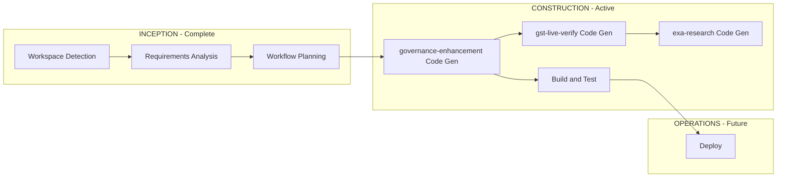

# Execution Plan — VyapaarClaw Enhancement Program

## Workflow Visualization

## Phase Execution Decisions

| Phase | Depth | Execute | Rationale |
|-------|-------|---------|-----------|
| Reverse Engineering | — | Skip | graphify + prior exploration sufficient |
| Requirements | Standard | Yes | Multi-feature enhancement program |
| User Stories | — | Skip | Engineering-led; requirements traceable |
| Application Design | — | Skip | Extending existing architecture |
| Units Generation | Minimal | Yes | 3 units across 3 phases |
| Functional Design | — | Skip | Business logic documented in roadmap |
| NFR Design | — | Skip | Security patterns exist |
| Code Generation | Full | Yes | Per unit |
| Build and Test | Standard | Yes | pytest suite |

## Units of Work

### Unit 1: governance-enhancement (Phase 1 — NOW)

- Extend models and ReasonCode
- GovernanceOptions config
- Engine wiring: GST, IFSC, anomaly, sanctions
- Vendor trust score module
- Fix comprehensive_vendor_screen
- Tests

### Unit 2: live-verification (Phase 2)

- gst_providers.py protocol + Browserwire client
- exa_client.py + research_vendor MCP tool
- adverse_media.py
- Authsome bootstrap docs

### Unit 3: full-cfo-platform (Phase 3)

- python-accounting ledger
- Darts forecaster
- Workflow persistence
- Web dashboard live MCP

## Multi-Package Change Sequence

1. `src/vyapaar_mcp/` — core Python MCP server (Phase 1–3)
2. `apps/web/` — dashboard (Phase 2)
3. `skills/` — CFO delegation updates (Phase 2)
4. `docs/` — documentation (ongoing)

## Approval

- [x] User directed implementation start 2026-06-06
- [x] Phase 1 scope approved implicitly via "begin implementation"
