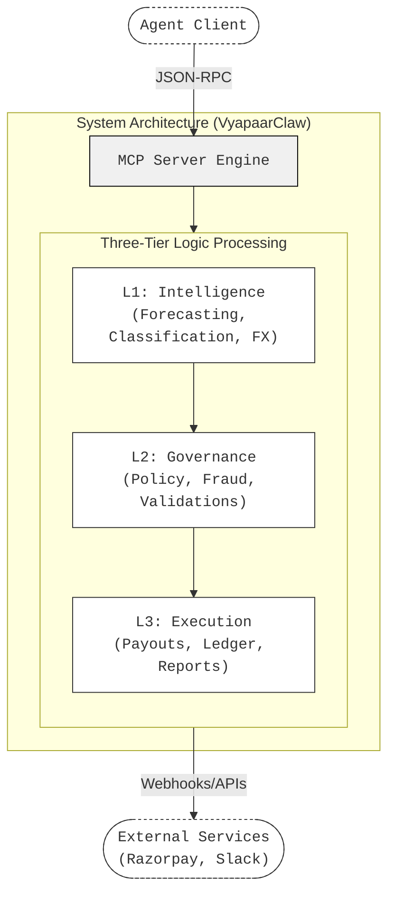
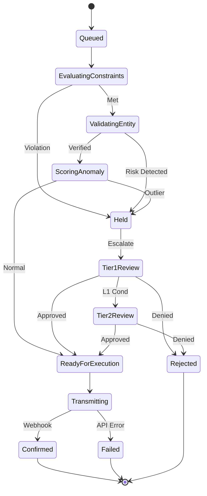
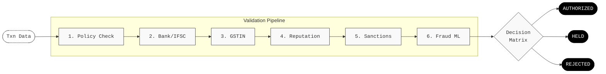
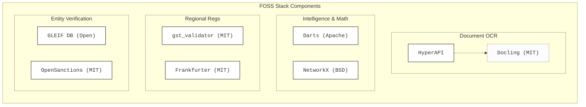

# VyapaarClaw Architecture

## Overview

VyapaarClaw is an enterprise-grade Model Context Protocol (MCP) server written in Python, functioning as an **AI CFO** for financial governance. It evaluates, audits, and securely orchestrates corporate payouts, ensuring tight human-in-the-loop and LLM-driven policy alignment before funds move via platforms like Razorpay.

The system exposes **37 MCP tools** across three intelligence layers: **KNOW** (intelligence), **GUARD** (governance), and **ACT** (execution).

## Full Architecture Diagram



## Three-Layer Architecture

### 🧠 KNOW — Intelligence Layer

The intelligence layer provides the CFO with financial awareness:

| Component | Tool | FOSS Library |
|-----------|------|-------------|
| **Cash Flow Forecaster** | `forecast_budget_runway` | Darts/EWMA + numpy |
| **Transaction Categorizer** | `categorize_transaction` | Keyword matching + FinBERT |
| **Contract Analyzer** | `analyze_contract` | spaCy/Regex NLP |
| **Currency Converter** | `convert_currency` | Frankfurter API (ECB data) |
| **Financial Calendar** | `get_indian_financial_calendar` | holidays + exchange_calendars |

### 🛡️ GUARD — Governance Layer

The governance layer enforces policy and catches fraud:

| Component | Tool | FOSS Library |
|-----------|------|-------------|
| **6-Layer Pipeline** | `score_transaction_risk` | IsolationForest + GLEIF + Safe Browsing |
| **Graph Fraud Detection** | `detect_fraud_network` | NetworkX + PyGOD |
| **Vendor KYB** | `screen_vendor_sanctions` | OpenSanctions + GLEIF |
| **Bank Validation** | `validate_bank_account` | razorpay/ifsc (RBI data) |
| **GST Compliance** | `validate_gstin`, `calculate_gst`, `check_tds` | gst_validator_india |
| **Approval Workflow** | `manage_payout_workflow` | Transitions (state machine) |

### ⚡ ACT — Execution Layer

The execution layer performs actions:

| Component | Tool | FOSS Library |
|-----------|------|-------------|
| **Razorpay Payouts** | `create_payout` | Razorpay Go MCP sidecar |
| **Double-Entry Ledger** | `track_payout_in_ledger`, `get_trial_balance` | python-accounting |
| **PDF Reports** | `generate_compliance_report` | FPDF2 |
| **Notifications** | `send_slack_notification` | Slack / Telegram / ntfy |

## Payout Approval Workflow

Every payout passes through a formal state machine with multi-level approvals:



## Governance Pipeline Flow

End-to-end flow from invoice/transaction input through governance to decision:



## FOSS Compliance Matrix

Every core capability has a FOSS alternative — no proprietary lock-in:



## Core Components

1. **MCP Server Engine (37 Tools)**:
   - Standard MCP JSON-RPC Server interface enabling connection to LLM clients
   - Serves internal Python actions and bridges externally to Go-based binaries

2. **AI CFO & Governance LLMs**:
   - Uses context windows to evaluate `HELD`, `APPROVED` or `REJECTED` states
   - Leverages localized MLX Mistral schemas, enforcing compliance safely off-grid
   - Dual-LLM quarantine pattern for prompt injection defense

3. **CFO Intelligence Layer** (NEW):
   - **Forecasting**: Budget runway prediction with EWMA trend detection
   - **Categorization**: Auto-tagging payouts by spending category
   - **Contract Analysis**: NLP extraction of payment terms and penalty clauses
   - **GST/TDS Compliance**: GSTIN validation, tax calculation, TDS deduction
   - **Multi-Currency**: Live FX rates with historical auditing
   - **Graph Fraud Detection**: Shared PAN/bank account detection, circular payment rings
   - **Sanctions Screening**: OpenSanctions watchlist + GLEIF entity verification
   - **Double-Entry Ledger**: IFRS-style journal entries for every payout
   - **PDF Reports**: Auto-generated compliance reports with charts

4. **Data Tier (Postgres & Redis)**:
   - **PostgreSQL (`asyncpg`)**: Immutable event logging, payout decisions, audit trails
   - **Redis (`hiredis`)**: Rate-limits, budget caching, anomaly detection computations

5. **User Interfaces**:
   - **Terminal UI (`Textual`)**: Deep system-level debugging, live metric feeds
   - **Web UI (`Next.js / React`)**: Human-facing CFO dashboard

6. **Exposed Action Providers (Egress)**:
   - **Razorpay**: Direct payout disbursement and vendor link creation
   - **Slack / Telegram / ntfy**: Notification channels for human-in-the-loop approvals

## Project Structure

```
vyapaarclaw/
├── apps/web/                    # Next.js web dashboard
├── src/
│   ├── cli/                     # Node.js CLI
│   ├── vyapaar_mcp/             # Python MCP server
│   │   ├── audit/               # Decision logging
│   │   ├── cfo/                 # 🆕 CFO Intelligence Layer
│   │   │   ├── calendar.py      #   Indian financial calendar
│   │   │   ├── currency.py      #   Multi-currency FX conversion
│   │   │   ├── tax.py           #   GST/TDS compliance
│   │   │   ├── bank.py          #   IFSC/bank validation
│   │   │   ├── categorizer.py   #   Expense categorization
│   │   │   ├── forecaster.py    #   Cash flow forecasting
│   │   │   ├── ledger.py        #   Double-entry bookkeeping
│   │   │   ├── fraud.py         #   Graph fraud detection
│   │   │   ├── workflow.py      #   Payout state machine
│   │   │   ├── reports.py       #   PDF report generation
│   │   │   ├── sanctions.py     #   OpenSanctions screening
│   │   │   └── contracts.py     #   Contract analysis
│   │   ├── db/                  # Redis + PostgreSQL
│   │   ├── egress/              # Notifications + Razorpay
│   │   ├── governance/          # Policy engine
│   │   ├── ingress/             # Webhooks + polling
│   │   ├── llm/                 # Azure OpenAI / Dual-LLM
│   │   ├── observability/       # Metrics
│   │   ├── reputation/          # Safe Browsing, GLEIF, anomaly
│   │   ├── resilience/          # Circuit breakers
│   │   └── server.py            # FastMCP server (37 tools)
│   └── entry.ts
├── skills/                      # OpenClaw skills
├── docs/
│   ├── diagrams/                # 🆕 Mermaid + PNG diagrams
│   ├── ARCHITECTURE.md          # This file
│   ├── SYSTEM_DESIGN.md         # Security governance
│   ├── FOSS_RESEARCH.md         # FOSS tools research
│   └── FOSSHACK_SUBMISSION.md   # Submission content
└── tests/
```
