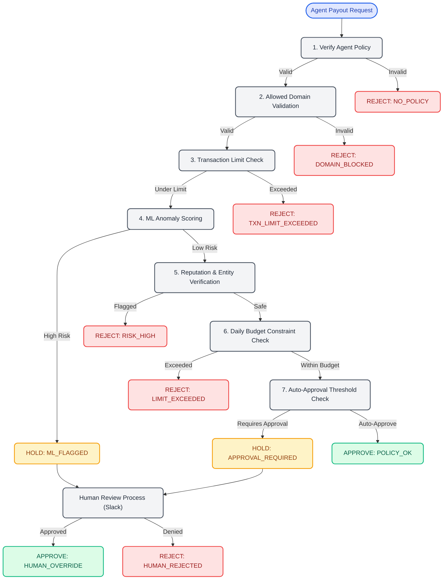

# System Design & Security Governance

VyapaarClaw implements a 6-layer protocol-level security enforcement model for managing AI financial expenditures. The pipeline leverages atomic database mutations and fails closed automatically to guarantee absolute control.

## Governance Execution Flow

### The Security Pipeline (Fail-Closed)

Our governance decision engine guarantees an impenetrable firewall between the LLM and Razorpay. When an agent signals intent to execute a payout, it MUST clear the following layered gauntlet:

1. **Policy Presence Check**: The agent making the call must have a valid configured spend policy provisioned in Postgres.
2. **Domain Policy Enforcement**: Blacklisted or unauthorized domain destinations are instantly rejected.
3. **Transaction Limit Checking**: Hard ceiling checks on individual atomic payload values.
4. **Machine Learning Anomaly Engine**: Spending pattern validation. Historical norms are analyzed off-grid using `IsolationForest` via scikit-learn. Unusual hours or velocity frequency vectors trigger a preemptive `HOLD` state.
5. **Vendor Reputation**:
    - **Google Safe Browsing v4**: Deep lookup of recipient vendor links to block phishing and malware proxies.
    - **GLEIF Entity Verification**: Ensuring the legal entity is registered globally.
6. **Atomic Redis Budget Limits Check**: Enforces immutable rate-limiting windows and precise daily budget deduction via `INCRBY` logic. If multiple agents attempt a race-condition payout, Redis operations sequentially enforce the ledger.

Finally, if the amount surpasses the pre-configured *auto-approval threshold* — or if the ML flagged a suspicious anomaly — the transaction goes into a strict manual `HOLD` state and escalates to a human operator via Slack callback ping for the final verdict.
